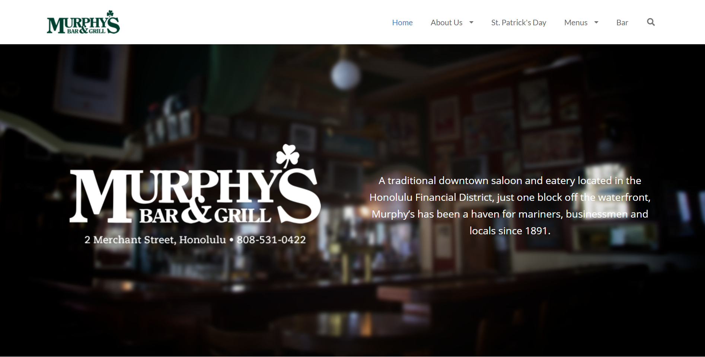
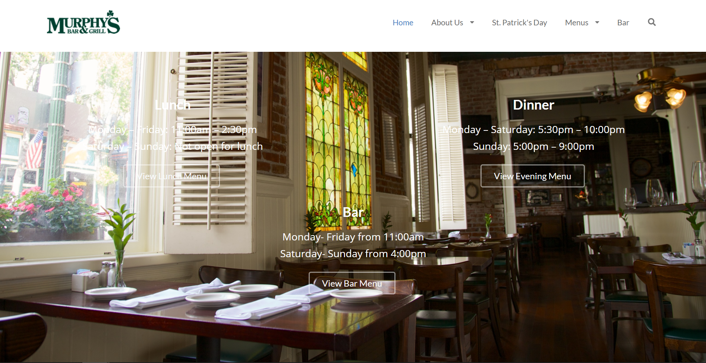

## My roots
Before working with UI Frameworks, I already have had experience with HTML and dabbled with CSS. This markup language came easy to me, as the language for defining and styling elements were very straight forward. Though, such a simple framework may only be suitable for reading, not so much for design and looking elegant. With the help of Semantic UI, we were able to effortlessly create pages that also look visually appealing.

## Experience and challenges
Semantic UI is a unique framework that implements the use of natural English language to link concepts in HTML. For example, if I want to include a large, red button on my site, I would simply add 
```html
<button class="ui large red button"></button>
``` 
As simple as that, Semantic UI will automatically format an element with such keywords without the hassle of styling it in CSS. Along with the many other adjectives to go with other pre-existing elements, the possibilities of web designing are endless. However, there is a challenge when it comes to learning a new framework and that is knowing what possibilities are available to me. Relying on frameworks entirely truly has its limits, as the variations for elements are restricted to basic English adjectives to keep editing concise. If one would like to fully control the styles of elements, then further editing with an additional stylesheet is needed. Although, if these challenges are overcome, web developers and software engineers would surely seize its benefits of effective markup language styling.

## Going beyond with Murphys
Recreating the [Murphy's](http://murphyshawaii.com/) landing page in semantic ui was one of our in-class WODs in October. Using nothing but Semantic UI, we worked in pairs to replicate the design of the page as best as we could. However, we were tasked to only replicate what was given to us on a [screenshot](http://courses.ics.hawaii.edu/ics314f19/morea/ui-frameworks/inclass-murphys.html), which was an outdated version of the site, since it has gone through some redesign. The screen shot provided just three simple components: a navigation bar, a middle main image, and a simgple three-column footer. This was easily achievable in under the 20 minute Rx time limit. However, I wanted to push myself even more by replicating the actual website. Looking closer, it actually displays two background images at once: a dimly-lit bar at the top of the page and a window-seated area when you scroll to the bottom. After devling in for more research, this effect was called a "Parallax:" a web site trend where the background content (i.e. an image) is moved at a different speed than the foreground content while scrolling. A working example can be found [here](https://www.w3schools.com/howto/howto_css_parallax.asp). Implamenting this effect granted me the tools needed to properly replicate the actual design of the Murphy's landing. Here are my results:





The code for my implamentation can be found on GitHub [here](https://github.com/nadine-alcantara/murphys/tree/background-effect)

## Vision for the future
Nonetheless, UI Frameworks has shown me the power of its simplicity and effectiveness through the usage of noun modification. Although it was a challenge at first, from breaking the boundaries of editing plain HTML by hand to learning an entirely new subset of keywords in an already foreign language, frameworks maybe something I could get used to. With enough practice, I will come to utilizing its potential to the fullest, as well as tinkering with other available frameworks like Twitter Bootstrap. 
