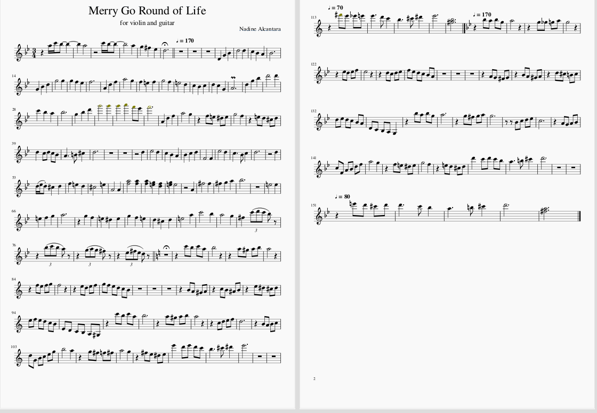

[Musescore](https://musescore.org/en) is a music composition and notation software that helped me create my arrangement 

Joe Hisaishi's composition of _Merry Go Round of Life_ for the famouse Ghibli Movie _Howl's Moving Castle_ has always been my favorite piece of his.
