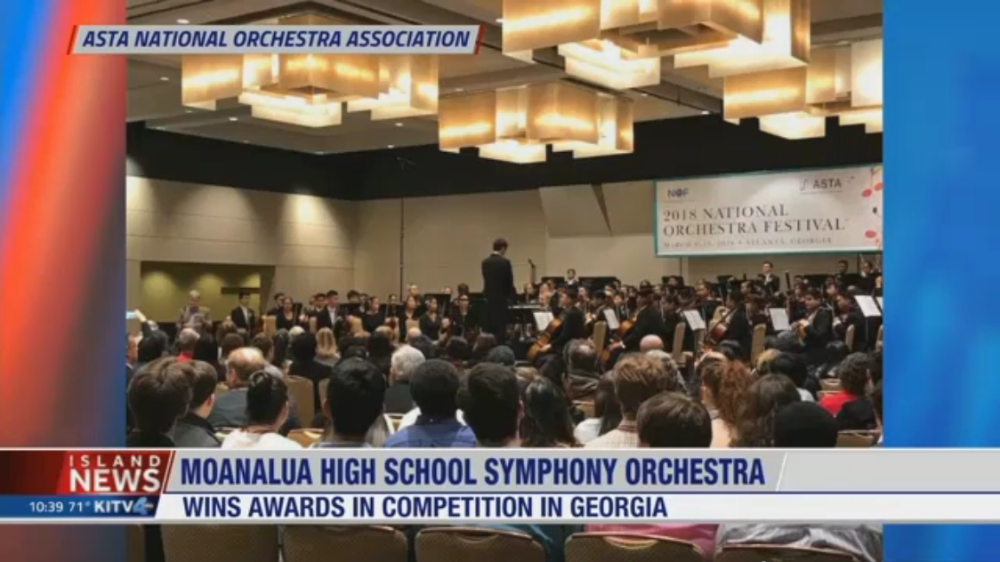
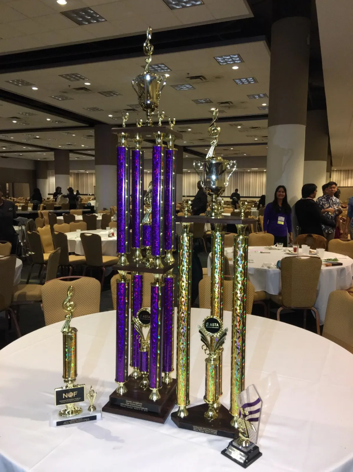

During my senior year in Moanalua High School, the MoHS Symphony had the honor and blessings to travel to the National Orchestra Festival back in Spring of 2018. This event is in conjunction with the American String Teacher's Association (ASTA) National Conference. Overall, this was the perfect opportunity for me and my peers to expose ourselves to the music industry by making connections with other orchestra groups from all over the mainland, attend various vendors at the conference, and receive valuable feedback on our performance from notable clinicians. Our symphony performed four pieces of intense repertoire at the last day of the festial. During the award ceremony, we were astounded to receive first place under the high school division, as well as the overall fesival Grand Champion award.

However, this journey to success was not an easy task. I was a second chair 1st violin at the time so I was one of the leaders for my section alongside my stand partner. This meant that we had the responsibilities of guiding our violin section to blend together as a cohesive team. Leadership did not come easy for an introvert like me, but I knew I was capable to learn and grow as a leader if our orchestra director trusted me to be in the front.
